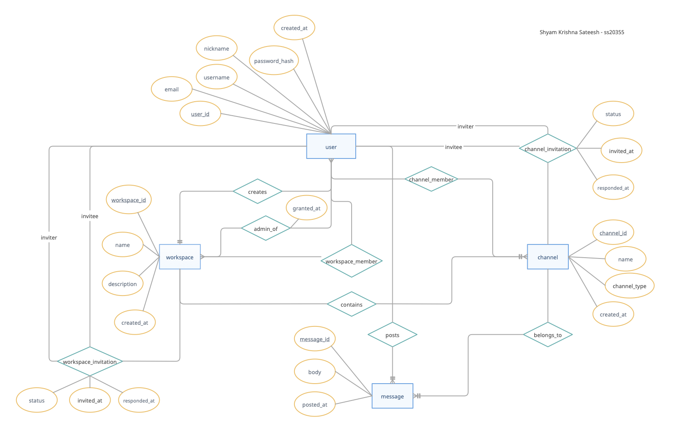
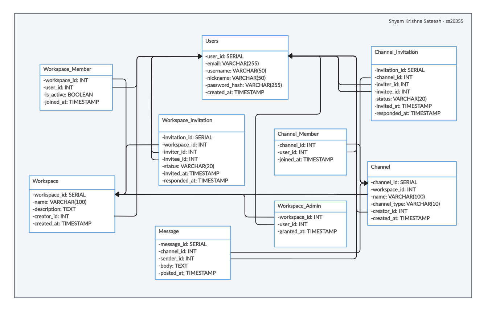

# snickr

> A full-stack web-based team collaboration system — think Slack, built from scratch.


Built as the semester project for **CS 6083 — Principles of Database Systems** at NYU Tandon, Spring 2026. Covers the full stack from ER diagram and relational schema design through to a working web application with security, transactions, and access control.

---

## Try It Out

> 🚀 **[Live Demo → snickr-production.up.railway.app](https://snickr-production.up.railway.app)**

| Username | Password | Role |
|---|---|---|
| `priya` | `demo1234` | Admin — Axiom HQ |
| `marcus` | `demo1234` | Admin — Axiom HQ |
| `sofia` | `demo1234` | Admin — Design Studio |

---

## What It Does

Snickr lets teams communicate in organized, permission-controlled workspaces.

- **Workspaces** — Create team groups with names and descriptions. The creator becomes admin automatically.
- **Channels** — Three types within each workspace:
  - `public` — any workspace member can join and post freely
  - `private` — invite-only, only accessible to invited members
  - `direct` — private conversation between exactly two users
- **Messaging** — Post and read messages chronologically within any channel you're a member of
- **Invitations** — Admins invite users to workspaces; channel members invite others to private channels. Accept or decline from the invitations page.
- **Admin management** — Workspace admins can promote any member to admin
- **Search** — Full-text keyword search across all messages, scoped to only what the logged-in user can see
- **Access control** — All authorization enforced at the application layer without DBMS permissions

---

## Tech Stack

| Layer | Technology | Why |
|---|---|---|
| Language | Python 3 | Strong ecosystem, readable, concise |
| Web Framework | Flask 3.0 | Lightweight — routes map directly to functions, no ORM overhead |
| Database | PostgreSQL 18 | Robust constraint enforcement, SERIAL keys, ILIKE, transactions |
| DB Driver | psycopg2 2.9 | Native parameterized queries — SQL injection protection built in |
| Templating | Jinja2 | Bundled with Flask, auto-escapes all output by default (XSS protection) |
| Password Hashing | Werkzeug | PBKDF2-HMAC-SHA256 — industry standard, never stores plaintext |
| Sessions | Flask signed cookies | Cryptographically signed — user_id can't be forged by the client |
| Styling | Custom CSS | IBM Plex Sans + Mono, dark theme, no frameworks |

---

## Database Schema

9 tables implementing a fully normalized relational schema, translated from an ER diagram with 4 strong entity sets and 9 relationship sets (including 2 ternary relationships).

### ER Diagram



### Relational Schema



```
users                  — registered accounts (email + username globally unique)
workspace              — top-level team groups
workspace_admin        — many-to-many: admin privileges (tracked separately from membership)
workspace_member       — many-to-many: workspace membership (soft delete via is_active flag)
workspace_invitation   — ternary: who invited whom into which workspace
channel                — conversations, typed as public / private / direct
channel_member         — many-to-many: channel membership
channel_invitation     — ternary: who invited whom into which channel
message                — chronologically ordered posts
```

**Key design decisions:**
- Single `channel` table with `channel_type` column rather than three separate tables — simpler queries, no schema duplication
- Separate `workspace_admin` and `workspace_member` tables — membership and admin privilege are independent states that change independently
- Soft delete on `workspace_member` via `is_active` — preserves join history without hard deleting rows
- Surrogate `SERIAL` primary keys on all tables — stable, independently addressable, no reliance on natural keys
- Two-user constraint on direct channels enforced at application level — avoids complex triggers in the schema

---

## Security

**SQL Injection** — All queries in `db.py` use psycopg2 parameterized statements with `%s` placeholders. SQL and data are sent to PostgreSQL separately — user input is never concatenated into a query string.

**XSS** — Jinja2 auto-escapes every `{{ }}` expression by default. Script tags and HTML in user-generated content are converted to harmless escaped entities before reaching the browser. No `|safe` filters are used on any user input.

**Password security** — Passwords are hashed with Werkzeug's PBKDF2-HMAC-SHA256 before storage. Plaintext is never persisted. Login uses `check_password_hash()` — no plaintext comparison.

**Session security** — `user_id` is stored in a Flask signed cookie. The cookie is cryptographically signed with the app's secret key; any tampering is detected and the session is rejected.

**Single DB account** — The app connects to PostgreSQL as one user. There are no per-user DBMS accounts. Access control is enforced entirely in Python by querying `workspace_member` and `channel_member` before serving any content.

---

## Transactions

Three operations are wrapped in explicit `psycopg2` transactions (`autocommit = False`, explicit `commit()` / `rollback()`):

1. **Create workspace** — Inserts into `workspace`, `workspace_member`, and `workspace_admin` atomically. Guarantees the creator is always both a member and an admin — no partial state possible.

2. **Accept workspace invitation** — Updates `workspace_invitation` status and inserts into `workspace_member` atomically. Prevents the invitation being marked accepted without the membership row being created.

3. **Accept channel invitation** — Same pattern for `channel_invitation` and `channel_member`.

---

## Project Structure

```
snickr/
├── app.py              # All Flask routes (21 routes)
├── db.py               # All database queries and transactions
├── requirements.txt
├── seed.sql            # Realistic sample data for demo
├── .env                # Local environment config (git-ignored)
├── .env.example        # Template — copy this to .env
├── .gitignore
├── images/
│   ├── er-diagram.png  # ER diagram (crow's foot notation)
│   └── schema.png      # Relational schema diagram
├── static/
│   └── style.css       # Full custom stylesheet
└── templates/
    ├── base.html        # Shared layout, nav, flash messages
    ├── invitations.html
    ├── search.html
    ├── auth/
    │   ├── login.html
    │   └── register.html
    ├── channel/
    │   ├── create.html
    │   └── detail.html  # Messaging view
    └── workspace/
        ├── create.html
        ├── detail.html  # Sidebar + members panel
        └── list.html
```

---

## Running Locally

**Prerequisites:** Python 3.8+, PostgreSQL, pip3

```bash
# 1. Clone
git clone https://github.com/shyamksateesh/snickr.git
cd snickr

# 2. Install dependencies
pip3 install -r requirements.txt

# 3. Set up environment
cp .env.example .env
# Edit .env with your PostgreSQL credentials

# 4. Create the database
psql postgres -c "CREATE DATABASE snickr;"
psql snickr < schema.sql

# 5. (Optional) Load sample data
psql snickr < seed.sql

# 6. Run
python3 app.py
# → http://localhost:5000
```

**.env format:**
```
DB_NAME=snickr
DB_USER=your_postgres_username
DB_HOST=localhost
DB_PORT=5432
DB_PASSWORD=

FLASK_SECRET_KEY=pick-a-long-random-string-here
FLASK_DEBUG=true
```

---

## Course Context

Built for **CS 6083 — Principles of Database Systems**, NYU Tandon School of Engineering, Spring 2026. Project 1 covered ER diagram design, relational schema translation, constraint definition, and 7 SQL queries. Project 2 added the full web frontend with security and concurrency requirements.

---

<p align="center">
  <b>Shyam Krishna Sateesh</b> · M.S. Computer Science · NYU Tandon · 2026<br>
  <a href="https://shyamksateesh.github.io">Portfolio</a> ·
  <a href="https://github.com/shyamksateesh">GitHub</a> ·
  <a href="https://linkedin.com/in/shyamksateesh">LinkedIn</a>
</p>